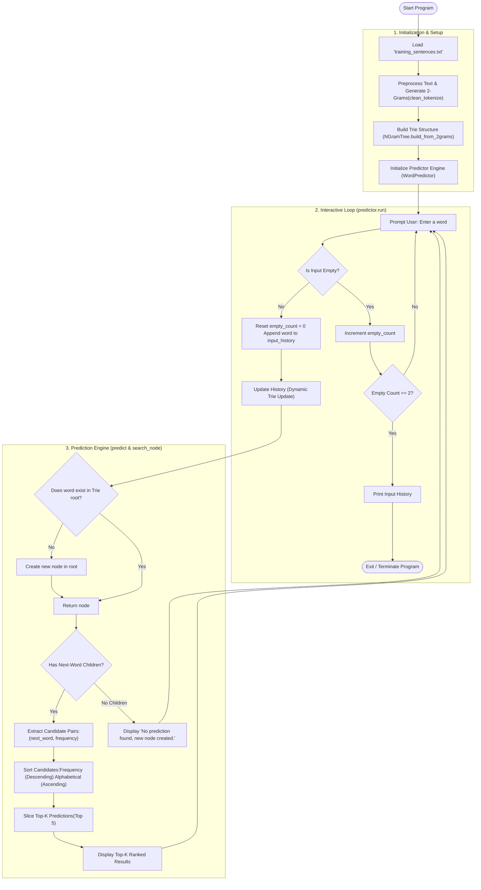

# Problem A: The Word Predictor
## Phase 2: Open Architecture
* **The Training Corpus:** We chose a basic conversational, technical, and general-topic English text file. It provides enough realistic word pairings to demonstrate the predictor's learning capability without requiring massive memory overhead.
* **Context Depth:** We implemented a 2-gram (Bigram) tree. It is highly performant, uses minimal memory, and maps a single `current_word` directly to its most probable candidate next words, which perfectly satisfies the core prediction requirement.
* **Tie-Breaking Logic:** Candidates are primarily ranked by frequency in descending order. When two or more words share the exact same frequency, the engine breaks the tie alphabetically (a → z). The top 5 results from this ranking are then displayed. This ensures the output is always deterministic and predictable rather than relying on random chance.
## Program flow

## Project Files
| **File** | **Purpose** |
| :--- | :--- |
| main.py | The program's entry point |
| predictor.py | Manages user input |
| preprocess.py | Tokenizes entry data |
| training_sentences.txt | Training dataset |
|trie.py | Defines TrieNode/NGramTree class |
|README.md | Demonstrate program's flow |
|disclosur.ai | AI usage log |